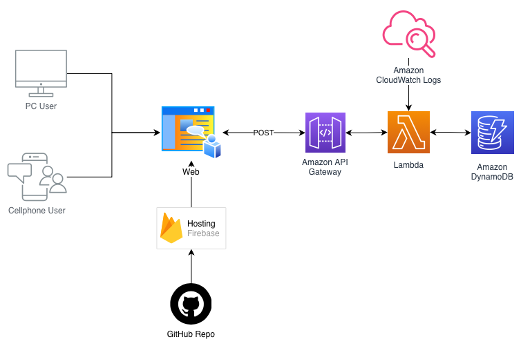

# URL Shortener - Backend

## Descripción

Este es el backend serverless del acortador de URLs, desarrollado con AWS Lambda (Python) y DynamoDB. Proporciona APIs REST para crear URLs cortas y redirigir a las URLs originales.

## Tecnologías Utilizadas

### AWS Lambda
**¿Por qué Lambda?**
- **Serverless**: No necesitas gestionar servidores, AWS se encarga de todo
- **Escalabilidad automática**: Se adapta automáticamente al tráfico (desde 0 hasta miles de peticiones)
- **Pago por uso**: Solo pagas por el tiempo de ejecución real (hasta 1 millón de solicitudes gratuitas)
- **Alta disponibilidad**: AWS garantiza 99.95% de uptime
- **Integración nativa**: Se integra perfectamente con otros servicios de AWS (DynamoDB, API Gateway, CloudWatch)
- **Cold start aceptable**: Para un acortador de URLs, los cold starts de Python (~100-300ms) son aceptables
- **Sin mantenimiento**: No hay que preocuparse por actualizaciones de SO, parches de seguridad, etc.

### Amazon DynamoDB
**¿Por qué DynamoDB?**
- **NoSQL flexible**: Estructura de datos simple (key-value) perfecta para este caso de uso
- **Rendimiento predecible**: Latencias de milisegundos (baja latencia)
- **Escalabilidad masiva**: Puede manejar millones de peticiones por segundo
- **Costo-efectivo**: Modo on-demand (pagas solo por lo que usas) o modo provisionado (predecible)
- **Sin administración**: Completamente administrado por AWS
- **Backup automático**: Point-in-time recovery disponible
- **Global Tables**: Fácil replicación multi-región si crece el proyecto

### Python 3.1x
- Rápido de desarrollar y mantener
- Excelente soporte de AWS SDK (boto3)
- Ideal para Lambda functions

## Estructura del Proyecto

```
backend/
├── lambda/
│   ├── create_url/
│   │   └── lambda_function.py      # Lambda para crear URLs cortas
│   └── redirect_url/
│       └── lambda_function.py      # Lambda para obtener URL original
├── docs/
│   └── api_documentation.md        # Documentación de las APIs
└── README.md                       # Este archivo
```
## Arquitectura utilizada


## Configuración de DynamoDB

### Crear la tabla `urls`

#### Opción 1: Mediante Consola de AWS

1. Ve a **DynamoDB** en la consola de AWS
2. Click en **"Crear tabla"**
3. Configura los siguientes parámetros:

**Configuración básica:**
```
Nombre de la tabla: urls
Clave de partición: shortCode (String)
```

**Configuración de capacidad:**
```
Modo de lectura/escritura: Bajo demanda (On-demand)
```
*Nota: Puedes usar "Aprovisionado" si es que ya conoces tu tráfico y quieres optimizar costos*

**Configuración de cifrado:**
```
Cifrado en reposo: Clave propiedad de Amazon DynamoDB
```

4. Click en **"Crear tabla"**
5. Espera a que el estado sea "Active"

#### Opción 2: Mediante AWS CLI

```bash
aws dynamodb create-table \
    --table-name urls \
    --attribute-definitions AttributeName=shortCode,AttributeType=S \
    --key-schema AttributeName=shortCode,KeyType=HASH \
    --billing-mode PAY_PER_REQUEST \
    --region us-east-1
```

### Estructura de Items en DynamoDB

Cada URL acortada se almacena con la siguiente estructura:

```json
{
  "shortCode": "14FeKu",
  "originalUrl": "https://example.com/very-long-url-here",
  "createdAt": "2024-12-06T10:30:00.000Z",
  "clicks": 0,
  "lastAccessed": null
}
```

**Campos:**
- `shortCode` (String) - Primary Key: Código único de 6 caracteres
- `originalUrl` (String): URL original completa
- `createdAt` (String): Timestamp ISO 8601 de creación
- `clicks` (Number): Contador de veces que se ha accedido
- `lastAccessed` (String): Timestamp ISO 8601 del último acceso (null si nunca se accedió)

### Índices (Opcional)

Si necesitas consultas adicionales, puedes crear índices secundarios:

```bash
# Índice para buscar por URL original
aws dynamodb update-table \
    --table-name urls \
    --attribute-definitions AttributeName=originalUrl,AttributeType=S \
    --global-secondary-index-updates \
    '[{
        "Create": {
            "IndexName": "originalUrl-index",
            "KeySchema": [{"AttributeName":"originalUrl","KeyType":"HASH"}],
            "Projection": {"ProjectionType":"ALL"},
            "ProvisionedThroughput": {"ReadCapacityUnits":5,"WriteCapacityUnits":5}
        }
    }]'
```

## Configuración de AWS Lambda

### 1. Crear función Lambda para Crear URLs

#### Mediante Consola de AWS:

1. Ve a **Lambda** en la consola de AWS
2. Click en **"Crear función"**
3. Selecciona **"Crear desde cero"**

**Información básica:**
```
Nombre de la función: url-shortener-create
Runtime: Python 3.14 (o la última disponible)
Arquitectura: x86_64
```

**Permisos:**
```
Rol de ejecución: Crear un rol nuevo con permisos básicos de Lambda
```

4. Click en **"Crear función"**
5. En la pestaña **"Código"**, copia el contenido de `lambda/create_url/lambda_function.py`
6. Click en **"Deploy"**

#### Configurar variables de entorno:

En la pestaña **"Configuración"** → **"Variables de entorno"**:

```
DYNAMODB_TABLE = urls
BASE_URL = https://shorter.tu-dominio.com
```

#### Configurar permisos IAM:

1. Ve a **"Configuración"** → **"Permisos"**
2. Click en el rol de ejecución
3. Añade la política inline:

```json
{
    "Version": "2012-10-17",
    "Statement": [
        {
            "Effect": "Allow",
            "Action": [
                "dynamodb:PutItem",
                "dynamodb:GetItem"
            ],
            "Resource": "arn:aws:dynamodb:REGION:ACCOUNT_ID:table/urls"
        }
    ]
}
```

Reemplaza `REGION` y `ACCOUNT_ID` con tus valores.

#### Configuración adicional:

En **"Configuración"** → **"Configuración general"**:
```
Memoria: 128 MB (suficiente para esta función)
Timeout: 15 segundos (suficiente para esta función)
```

### 2. Crear función Lambda para Redirección

Repite los mismos pasos anteriores pero con estos cambios:

**Información básica:**
```
Nombre de la función: url-shortener-redirect
Runtime: Python 3.14 (o la última disponible)
```

**Variables de entorno:**
```
DYNAMODB_TABLE = urls
```

**Código:** Usa el contenido de `lambda/redirect_url/lambda_function.py`

**Permisos IAM adicionales:**
```json
{
    "Version": "2012-10-17",
    "Statement": [
        {
            "Effect": "Allow",
            "Action": [
                "dynamodb:GetItem",
                "dynamodb:UpdateItem"
            ],
            "Resource": "arn:aws:dynamodb:REGION:ACCOUNT_ID:table/urls"
        }
    ]
}
```

## Configuración de API Gateway

### Crear API REST

1. Ve a **API Gateway** en la consola de AWS
2. Click en **"Crear API"**
3. Selecciona **"API REST"** → **"Crear"**

**Configuración:**
```
Nombre de API: url-shortener-api
Tipo de endpoint: Regional
```

### Configurar endpoints

#### Endpoint 1: POST /create (Crear URL corta)

1. Click en **"Acciones"** → **"Crear recurso"**
   ```
   Nombre del recurso: create
   Ruta del recurso: /create
   ```

2. Selecciona el recurso `/create` → **"Acciones"** → **"Crear método"** → **POST**

3. Configuración de integración:
   ```
   Tipo de integración: Función de Lambda
   Usar integración de proxy de Lambda: ✓
   Región de Lambda: tu-region
   Función de Lambda: url-shortener-create
   ```

4. Click en **"Guardar"** → **"Aceptar"** (dar permisos)

#### Endpoint 2: GET /redirect/{shortCode} (Obtener URL original)

1. Click en **"Acciones"** → **"Crear recurso"**
   ```
   Nombre del recurso: redirect
   Ruta del recurso: /redirect
   ```

2. Selecciona `/redirect` → **"Acciones"** → **"Crear recurso"**
   ```
   Nombre del recurso: {shortCode}
   Ruta del recurso: /{shortCode}
   Habilitar proxy de API Gateway: ✗
   ```

3. Selecciona `/{shortCode}` → **"Acciones"** → **"Crear método"** → **GET**

4. Configuración de integración:
   ```
   Tipo de integración: Función de Lambda
   Usar integración de proxy de Lambda: ✓
   Región de Lambda: tu-region
   Función de Lambda: url-shortener-redirect
   ```

5. Click en **"Guardar"** → **"Aceptar"**

### Habilitar CORS

Para ambos recursos (`/create` y `/redirect/{shortCode}`):

1. Selecciona el recurso
2. **"Acciones"** → **"Habilitar CORS"**
3. Configuración:
   ```
   Access-Control-Allow-Origin: *
   Access-Control-Allow-Headers: Content-Type,X-Amz-Date,Authorization,X-Api-Key,X-Amz-Security-Token
   Access-Control-Allow-Methods: GET,POST,OPTIONS
   ```
4. Click en **"Habilitar CORS y reemplazar encabezados CORS existentes"**

### Desplegar API

1. Click en **"Acciones"** → **"Implementar la API"**
2. Configuración:
   ```
   Etapa de implementación: [Nueva etapa]
   Nombre de la etapa: prod
   Descripción: Producción
   ```
3. Click en **"Implementar"**

4. **Copia la URL de invocación**, será algo como:
   ```
   https://abc123xyz.execute-api.us-east-1.amazonaws.com/prod
   ```

### URLs finales de tu API:

```
POST https://abc123xyz.execute-api.us-east-1.amazonaws.com/prod/create
GET  https://abc123xyz.execute-api.us-east-1.amazonaws.com/prod/redirect/{shortCode}
```

## Variables de Entorno

### Lambda: url-shortener-create
```
DYNAMODB_TABLE = urls
BASE_URL = https://shorter.tu-dominio.com
```

### Lambda: url-shortener-redirect
```
DYNAMODB_TABLE = urls
```

**Cómo configurarlas:**
1. Ve a tu función Lambda en la consola
2. Pestaña **"Configuración"** → **"Variables de entorno"**
3. Click en **"Editar"** → **"Agregar variable de entorno"**
4. Ingresa clave y valor
5. Click en **"Guardar"**

## Probar las APIs

### Crear URL corta

```bash
curl -X POST https://tu-api-gateway.com/prod/create \
  -H "Content-Type: application/json" \
  -d '{
    "url": "https://www.ejemplo.com/url-muy-larga"
  }'
```

Respuesta esperada:
```json
{
  "shortCode": "14FeKu",
  "shortUrl": "https://shorter.tu-dominio.com/14FeKu",
  "originalUrl": "https://www.ejemplo.com/url-muy-larga",
  "createdAt": "2024-12-06T10:30:00.000Z"
}
```

### Obtener URL original

```bash
curl https://tu-api-gateway.com/prod/redirect/14FeKu
```

Respuesta esperada:
```json
{
  "originalUrl": "https://www.ejemplo.com/url-muy-larga",
  "shortCode": "14FeKu",
  "clicks": 1
}
```

## Monitoreo

### CloudWatch Logs

Cada Lambda function guarda logs automáticamente en CloudWatch:

1. Ve a **CloudWatch** en la consola
2. **"Logs"** → **"Grupos de logs"**
3. Busca `/aws/lambda/url-shortener-create` y `/aws/lambda/url-shortener-redirect`

### Métricas importantes

En **CloudWatch** → **"Métricas**:
- **Invocations**: Número de veces que se ejecutó la función
- **Duration**: Tiempo de ejecución
- **Errors**: Número de errores
- **Throttles**: Peticiones limitadas por rate limit

### DynamoDB Metrics

En **DynamoDB** → **"Métricas"**:
- **ConsumedReadCapacityUnits**: Lecturas consumidas
- **ConsumedWriteCapacityUnits**: Escrituras consumidas
- **ThrottledRequests**: Peticiones limitadas

## Estimación de Costos

### AWS Lambda (Capa gratuita)
- **1 millón de peticiones gratis/mes**
- **400,000 GB-segundo de tiempo de cómputo gratis/mes**

Después de la capa gratuita:
- $0.20 por millón de peticiones
- $0.0000166667 por GB-segundo

### DynamoDB (Modo On-Demand)
- **25 GB de almacenamiento gratis**
- Después: $0.25 por GB/mes
- Escrituras: $1.25 por millón
- Lecturas: $0.25 por millón

### API Gateway
- **1 millón de llamadas gratis/mes** (primeros 12 meses)
- Después: $3.50 por millón de llamadas

**Ejemplo:** 100,000 URLs acortadas/mes + 500,000 redirecciones/mes:
- Lambda: ~$0.15
- DynamoDB: ~$0.50
- API Gateway: ~$2.10
- **Total: ~$2.75/mes** (después de capa gratuita)

## Seguridad

### Buenas prácticas implementadas:
- Validación de URLs
- CORS configurado
- Variables de entorno para configuración
- Principio de menor privilegio en IAM roles
- Logs habilitados en CloudWatch

### Mejoras a considerar:
- [ ] Implementar API Key en API Gateway
- [ ] Rate limiting por IP
- [ ] Validación contra URLs maliciosas
- [ ] Cifrado adicional en DynamoDB (KMS)
- [ ] WAF (Web Application Firewall) para protección DDoS

## Recursos Adicionales

- [AWS Lambda Documentation](https://docs.aws.amazon.com/lambda/)
- [DynamoDB Developer Guide](https://docs.aws.amazon.com/dynamodb/)
- [API Gateway Documentation](https://docs.aws.amazon.com/apigateway/)
- [Boto3 Documentation](https://boto3.amazonaws.com/v1/documentation/api/latest/index.html)

## Actualizaciones

Para actualizar el código de las funciones Lambda:

1. Edita el archivo `.py` correspondiente
2. Ve a la consola de Lambda
3. Pega el nuevo código
4. Click en **"Deploy"**
5. Prueba la función

## Escalabilidad

Este backend está diseñado para escalar automáticamente:

- **Lambda**: Escala de 0 a 1000 instancias concurrentes por defecto
- **DynamoDB**: Modo on-demand escala automáticamente según demanda
- **API Gateway**: Maneja 10,000 peticiones/segundo por defecto

Para tráfico mayor, considera:
- Implementar caching con CloudFront o ElastiCache
- Usar DynamoDB Global Tables para multi-región
- Configurar límites de concurrencia en Lambda (concurrencia aprovisionada)

---

Desarrollado por Jose Morillos con AWS Serverless Architecture